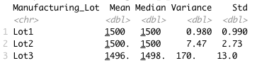

# MechaCar_Statistical_Analysis

## 1. Linear Regression to Predict MPG

  

* In the summary output, each Pr(>|t|) value represents the probability that each coefficient contributes a random amount of variance to the linear model. According to our results vehicle length and ground clearance (and Intercept) provide a non-random amount of variance to the linear model of mpg.

According to the results, the multi linear model is:

`(mpg = 6.27 * vehicle_length + 1.25e-3 * vehicle_weigth + 6.88e-2 * spoiler_angle -3.41 * AWD + 3.55 * ground_clearance - 1.04e+2)`

`(mpg = 6.27 * vehicle_length - 3.41 * AWD + 3.55 * ground_clearance - 104)`

* Then the slope of the linear model is not considered to be zero.

* R-square is 0.71 so 71% of the variations in mpg can be explained by changes in the vehicle length, the vehicle weight, the spoiler angle, the drivetrain and the ground clearance. We can consider this linear model as efficient to predict mpg of MechaCar prototypes.

## 2. Summary Statistics on Suspension Coils
### 2.1 Total Summary:

  

 * The design specifications for the MechaCar suspension coils dictate that the variance of the suspension coils must not exceed 100 pounds per square inch.
* The design specs are respected for all manufacturing lots in total with a global variance of 62.3 psi.

### 2.2 Lot Summary

  

* On the lot level, Lot 1 and Lot 2 are into specs with respectively variances of 0.98 and 7.5 psi. 
* The Lot 3 is out of specs with a variance of 170.3 psi.

## 3. T-Tests on Suspension Coils

### Summary of the t-test results across all manufacturing lots

  

From here we can see the true mean of the sample is 1498.78. With a p-Value of 0.06, which is higher than the common significance level of 0.05, there is NOT enough evidence to support rejecting the null hypothesis. That is to say, the mean of all three of these manufacturing lots is statistically similar to the presumed population mean of 1500.

### Summary of the t-test results acrossindividual lots:

  

1. Lot 1 sample actually has the true sample mean of 1500, again as we saw in the summary statistics above. With a p-Value of 1, clearly we cannot reject  the null hypothesis that there is no statistical difference between the observed sample mean and the presumed population mean (1500).

2. Lot 2 has essentially the same outcome with a sample mean of 1500.02, a p-Value of 0.61; the null hypothesis cannot be rejected, and the sample mean and the population mean of 1500 are statistically similar.

3.  Lot 3, THE mean is 1496.14 and the p-Value is 0.04, which is lower than the common significance level of 0.05. All indicating to reject the null hypothesis that this sample mean and the presumed population mean are not statistically different.

## 4. Design a Study Comparing the MechaCar to the Competition

### Metrics

* Safety Feature Rating
* Current Price (Selling)
* Drive Package
* Engine (Electric, Hybrid, Gasoline / Conventional)
* Resale Value
* Average Annual Cost of ownership (Maintenance)
* MPG (Gasoline Efficiency)
* Hypothesis: Null and Alternative

### Null Hypothesis (Ho)

Each performance metrics is statistically similar between the MechaCar prototype and all vehicle from the other manufacturers.

### Statistical Tests
A multiple linear regression would be used to determine the factors that have the highest correlation/predictability with the list selling price, we would need data of MechaCar vehicles and its competition, all gathered in a single dataframe where each metric is a column.
